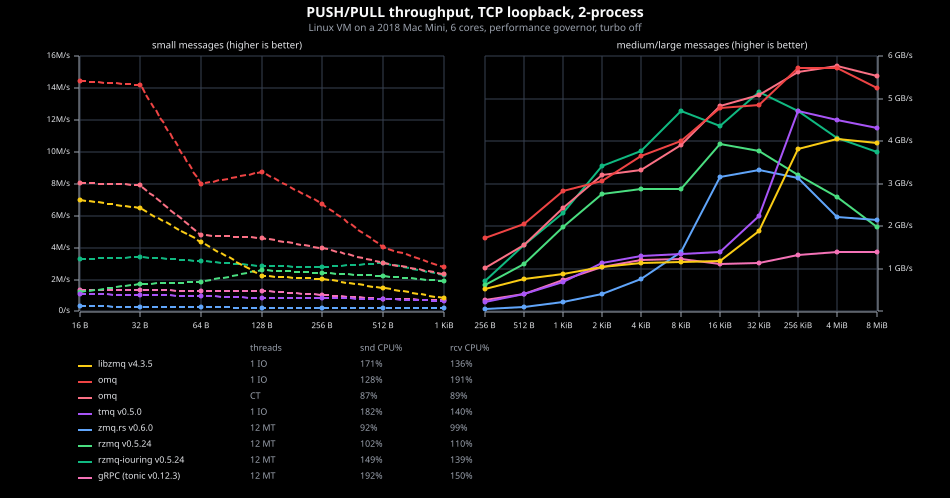
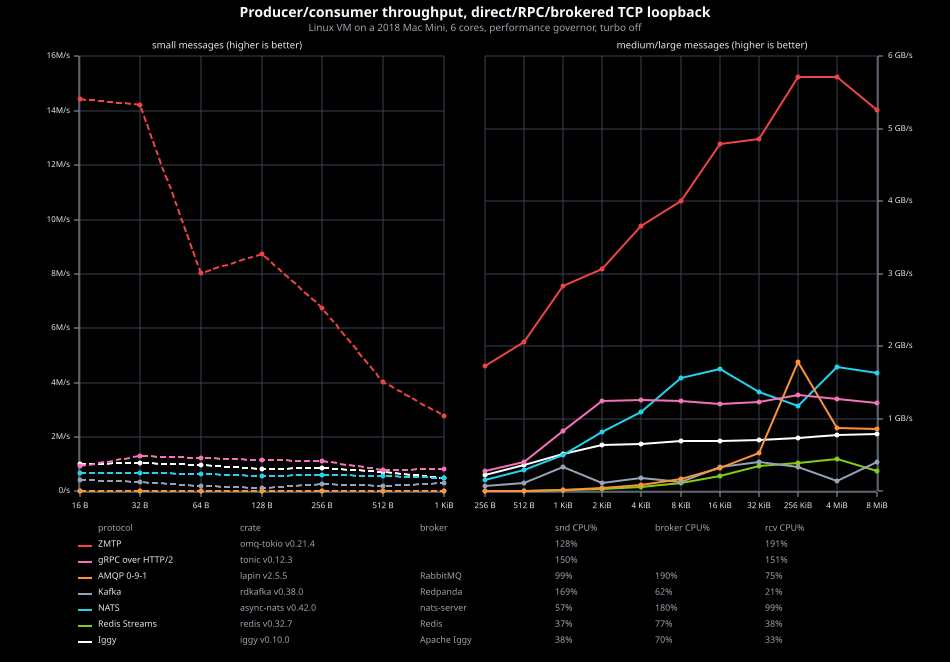
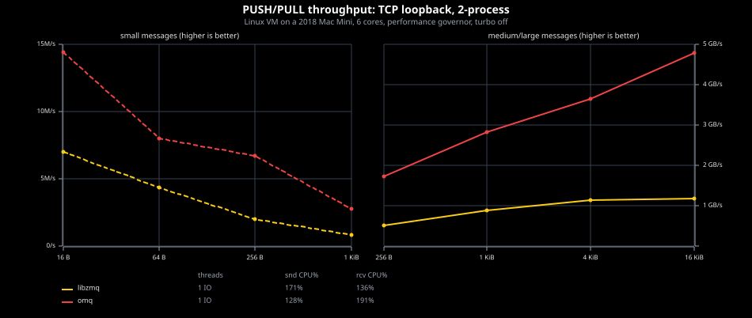
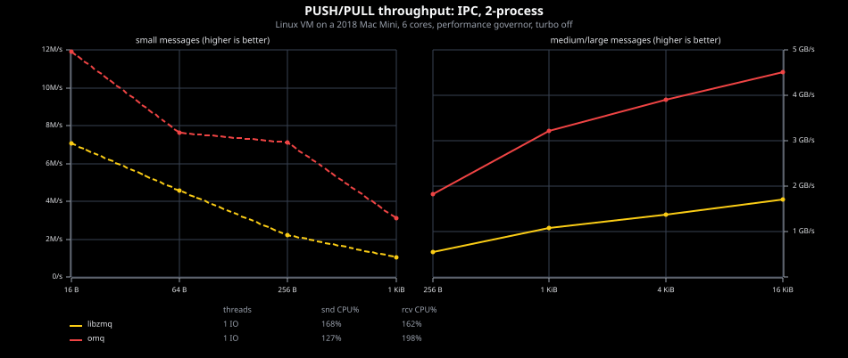
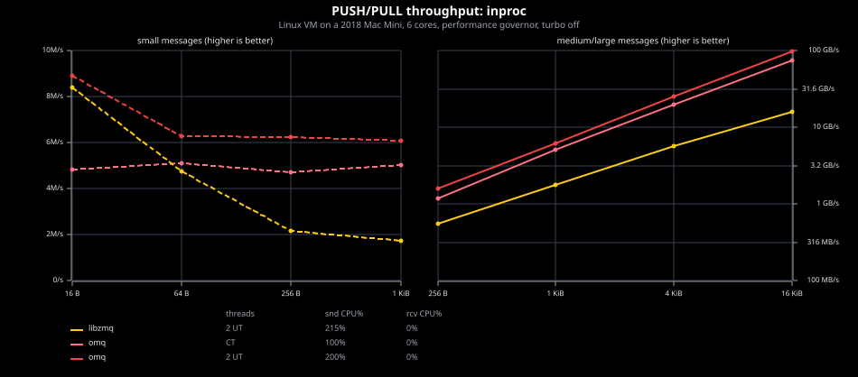
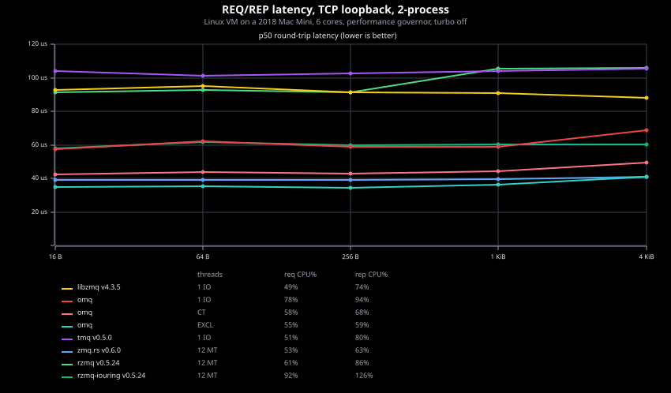
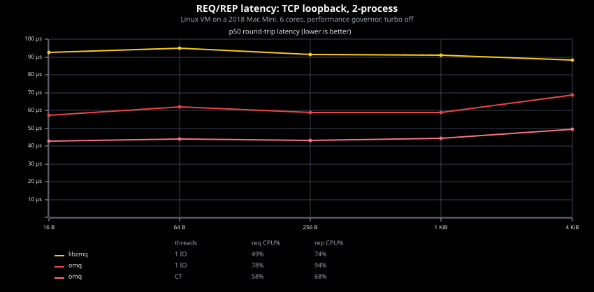
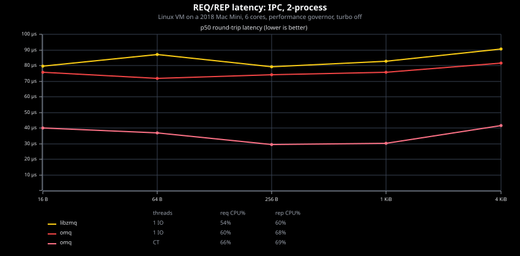
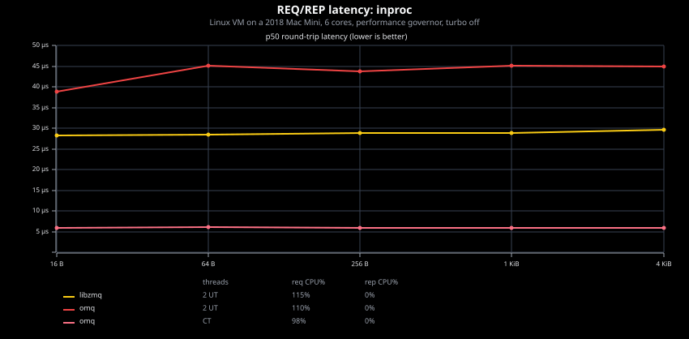
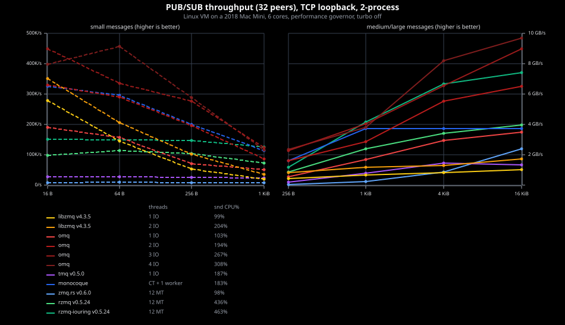

# Comparisons

These charts compare OMQ with `libzmq`, `tmq`, `zmq.rs`, `rzmq`, gRPC, and
brokered messaging systems. The benchmark runner records throughput,
latency, CPU time, and peer fairness where the pattern has multiple peers.

## Setup

- `libzmq v4.3.5`
- `tmq v0.5.0`
- `zeromq v0.6.0`
- `rzmq v0.5.24` in its normal and io_uring modes
- OMQ from this repository
- Rust gRPC over plaintext TCP, with opaque blob payloads and no QoS
- RabbitMQ, Redpanda, NATS, and Redis over loopback TCP using Rust clients

## Methodology

TCP and IPC charts use one benchmark process per peer, not multiple
threads inside one process.

- Two-peer charts use two processes.
- PUB/SUB and PUSH/PULL fan-in/fan-out charts use one process for each
  publisher, subscriber, pusher, or puller.
- `inproc` charts stay inside one process by definition.

Multi-peer charts report total throughput. PUSH fan-out charts also show
peer fairness: whiskers mark the slowest and fastest puller in a measured
round.

Transport coverage differs by implementation. Missing lines mean that
implementation does not expose a usable peer for that transport and
pattern in this benchmark suite.

## Runtime modes

The charts benchmark three OMQ execution styles where relevant:
`blocking::Socket` with dedicated IO threads, Tokio with two background IO
threads, and Tokio current-thread (CT), where application and IO work share
one runtime thread. The benchmark peer on the uninteresting side uses the
blocking API.

### Thread labels

- **IO** keeps application code out of the IO runtime and scales
  linearly across independent IO threads.
- **UT** means user thread: an application OS thread that owns a
  socket. The canonical inproc setup uses separate user threads for the
  communicating sockets.

`Context::current()` embeds OMQ in an existing tokio runtime:

- **CT** means current-thread Tokio: application tasks and OMQ IO share one
  current-thread runtime and one OS thread.
- **MT** means machine-threaded: the implementation may use the available
  machine parallelism. The chart shows the detected CPU count.

## PUSH/PULL Throughput

  

## Producer/Consumer Throughput

Direct ZMTP, gRPC streaming over HTTP/2, brokered queues, and
persistent stream/log systems over loopback TCP. Kafka and Redis Streams
are included for context, but they are not transparent ZMQ-style
PUSH/PULL sockets.

  

  

  

  

### Fan-Out

1-to-N PUSH/PULL over TCP. Whiskers show the slowest and fastest
puller in a measured round.

  

### Fan-In

N-to-1 PUSH/PULL over TCP.

  

## REQ/REP Latency

  

  

  

  

## PUB/SUB Throughput

  

  

  

## Producer/Consumer Throughput

Direct ZMTP, gRPC streaming over HTTP/2, brokered queues, and persistent
stream/log systems over loopback TCP. Kafka and Redis Streams are included
for context, but they are not transparent ZMQ-style PUSH/PULL sockets.

  

