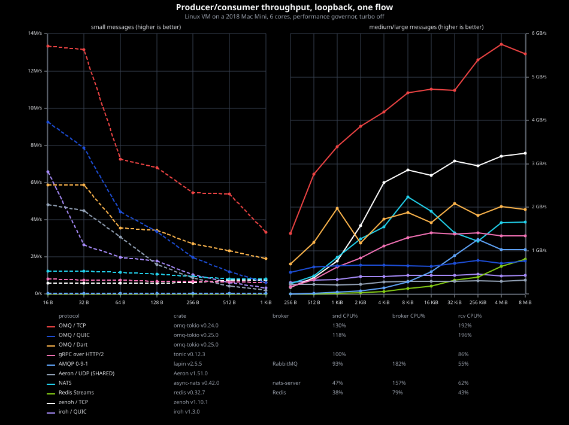
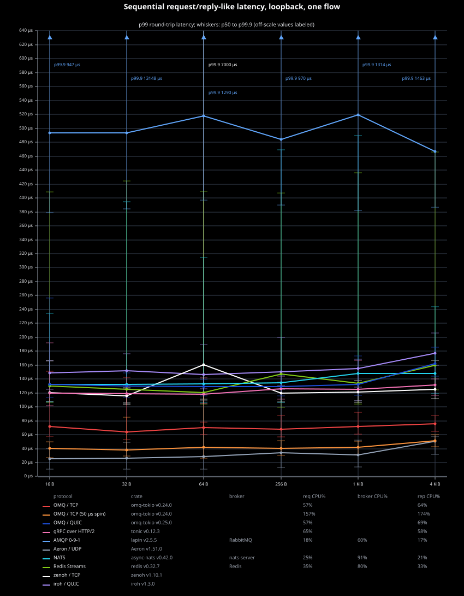

# Other Protocol Comparisons

These charts compare OMQ/ZMTP with other messaging and RPC protocols over
loopback. They measure one flow, not horizontal scaling. Aeron uses UDP and
iroh uses QUIC; OMQ's charts include TCP and QUIC.

## Setup

- OMQ/ZMTP and plaintext gRPC are direct process-to-process baselines.
- NATS uses transient NATS Core messaging.
- RabbitMQ uses nonpersistent AMQP 0-9-1 messages, auto-delete queues, and
  automatic consumer acknowledgments.
- Redis uses Redis Streams.
- Aeron uses UDP channels and one Media Driver in each process.
- zenoh uses a direct TCP peer link.
- iroh uses encrypted QUIC streams. Its throughput count measures fixed-size
  writes on a byte stream; QUIC does not preserve message boundaries.

Each data point uses an opaque byte payload. Throughput uses one sender, one
receiver, and one connection, queue, topic, or partition. Latency sends one
request at a time and measures requester-observed round-trip time. Delivery
and persistence semantics differ. The charts compare these concrete
low-overhead configurations, not equal durability guarantees. Aeron, zenoh,
and iroh each cover all 15 throughput and six latency sizes shown. A series
appears only where a measured data row exists.

All plotted comparisons were refreshed on 2026-10-02 with six vCPUs mapped to
six distinct physical cores. Direct endpoints ran in separate processes on
disjoint vCPU sets (requester/sender 1-2, responder/receiver 3-4). Brokered
senders used vCPU 1, receivers vCPU 2, and brokers vCPUs 3-5. No benchmark
peer or broker ran on vCPU 0. NATS used an 8 MiB `max_payload` setting.

Throughput uses a warmup followed by receiver-side 3-second timed windows
(three windows for OMQ and the direct rivals). Aeron's JVM warms up for 3
seconds; other implementations warm up for 1 second. Latency uses 2,000 warmup
exchanges (200,000 for Aeron's JVM) and 10,000 measured round trips per size.
The plotted latency row is the middle p99 run from three passes (five for
zenoh); its p50 and p99.9 come from that same run.

The latency runs used a KVM host `halt_poll_ns` of 2 ms. With the 200 μs
default, waking a blocked thread on this VM cost several times more once its
vCPU had idled longer than that, which inflated round trips that block on
every hop.

## Producer/Consumer Throughput

  

## Request/Reply-Like Latency

  

Lines show p99 round-trip latency. Whiskers span p50 to p99.9; values above
the linear axis are labeled at the plot edge.
