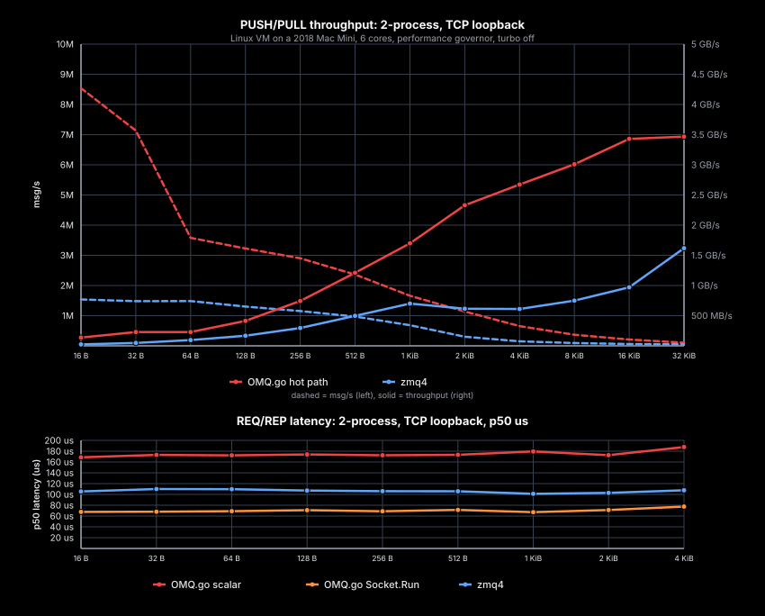

# OMQ.go

Modern Go binding for OMQ backed by `omq-tokio`.

The Go API owns a native OMQ context, and that context owns background IO
thread(s), matching the normal libzmq architecture. Public socket calls are
goroutine-safe and context-cancelable. Hot loops can bind directly to the
socket owner goroutine.



## Build, install, test

Requires Go 1.25 or newer, cgo, and a Rust toolchain.

Module path:

```sh
go get github.com/paddor/omq.rs/bindings/go
```

The Go package links against the native library built from `native/`:

```sh
cargo build --release --manifest-path native/Cargo.toml
go test ./...
```

From the repository root, the full binding check builds the native library and
runs the Go tests with the right library path:

```sh
./scripts/test-go.sh
```

## API Shape

- `Context` owns native IO threads and creates sockets.
- `Context.ShareKey()` / `OpenShared(...)` explicitly share one native context
  core and `inproc://` namespace across Go handles.
- `Socket` serializes native access through an owner goroutine, so public calls
  are race-free across goroutines.
- `Message` supports single-part and multipart payloads and copies input on
  construction.
- `RecvInto` is the direct single-part receive path when the caller owns the
  destination buffer.
- `Socket.Run(ctx, fn)` executes `fn` on the socket owner goroutine. Its
  `BoundSocket` methods use private native send/receive rings to amortize cgo
  cost without exposing public batch APIs.
- `Send`, `Recv`, and `RecvInto` take `context.Context`; `Try*` and timeout
  variants cover nonblocking and deadline-style code.
- `Socket.Channels(ctx, opts)` adapts one socket to Go channels at the edge.
  It is not the core hot path.
- `Monitor` exposes native socket events.
- Socket options cover HWM, linger, identity, pub/sub controls, routing
  controls, and compression transport settings.

Architecture detail: [`doc/architecture.md`](doc/architecture.md).

Example:

```go
func example() error {
	ctx, err := omq.Open(omq.Config{IOThreads: 1})
	if err != nil {
		return err
	}
	defer ctx.Close()

	pull, err := ctx.Socket(omq.Pull, omq.Linger(0))
	if err != nil {
		return err
	}
	defer pull.Close(context.Background())

	push, err := ctx.Socket(omq.Push, omq.Linger(0))
	if err != nil {
		return err
	}
	defer push.Close(context.Background())

	endpoint, err := pull.Bind("tcp://127.0.0.1:*")
	if err != nil {
		return err
	}
	if err := push.Connect(endpoint); err != nil {
		return err
	}

	runCtx, cancel := context.WithTimeout(context.Background(), 5*time.Second)
	defer cancel()

	if err := push.Send(runCtx, omq.String("hello")); err != nil {
		return err
	}
	msg, err := pull.Recv(runCtx)
	if err != nil {
		return err
	}
	fmt.Println(msg.String())
	return nil
}
```

Channel adapter:

```go
func receiveOne(runCtx context.Context, pull *omq.Socket) error {
	channels, err := pull.Channels(runCtx, omq.ChannelOptions{Capacity: 1024})
	if err != nil {
		return err
	}
	defer channels.Close()

	select {
	case msg := <-channels.Rx:
		fmt.Println(msg.String())
		return nil
	case err := <-channels.Errors:
		return err
	case <-runCtx.Done():
		return runCtx.Err()
	}
}
```
