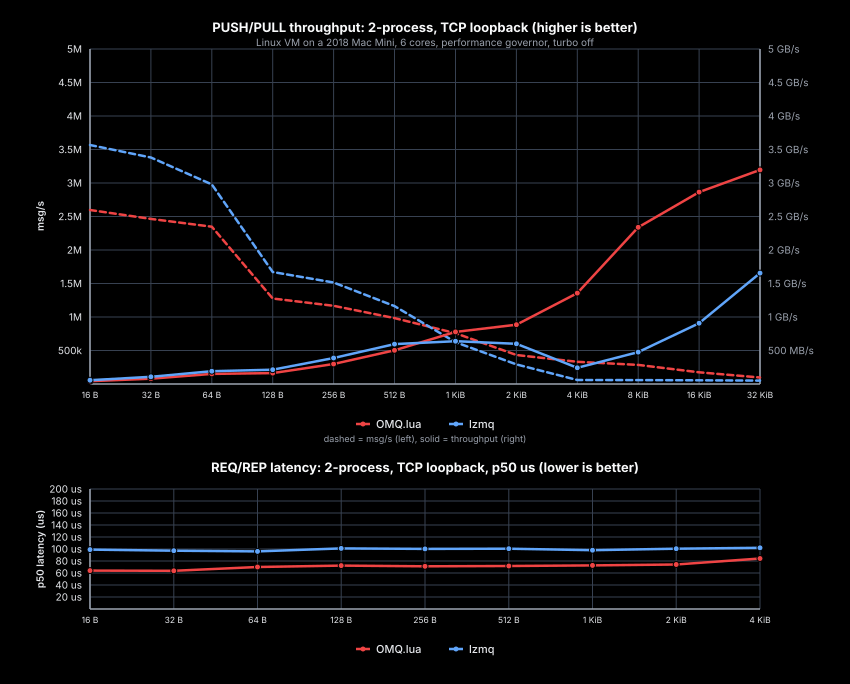

# OMQ.lua

Lua 5.4 binding for OMQ backed by `omq-libzmq`.

The binding is a Lua module loaded by `/usr/bin/lua`. Public Lua APIs live in
`lua/omq.lua`; the native module is a Rust `cdylib` that calls the
`omq-libzmq` C ABI directly.

## Build And Test

Requires `/usr/bin/lua`, Python 3 for charts, and a Rust toolchain.

```sh
./scripts/test-lua.sh
```

Manual equivalent:

```sh
cargo build --manifest-path bindings/lua/native/Cargo.toml
export LUA_PATH="$PWD/bindings/lua/lua/?.lua;;"
export LUA_CPATH="$PWD/bindings/lua/native/target/debug/lib?.so;;"
/usr/bin/lua bindings/lua/tests/test_basic.lua
```

## API Shape

- `omq.context({ io_threads = 1 })` owns the native context.
- `Context:socket("push", opts)` creates sockets by name or numeric constant.
- `Socket:bind(...)` returns the bound endpoint, including resolved wildcard
  TCP ports when available.
- `Socket:send("bytes")` sends a single-part message.
- `Socket:send({ "part1", "part2" })` sends multipart.
- `Socket:recv()` receives one part; `Socket:recv_parts()` receives all parts.
- `Socket:try_recv()` is nonblocking and returns `nil` when no message is
  ready.
- Options cover linger, send/receive timeout, send/receive HWM, and SUB
  subscribe/unsubscribe.

Example:

```lua
local omq = require("omq")

local ctx = omq.context({ io_threads = 1 })
local pull = ctx:socket("pull", { linger = 0, recv_timeout = 1000 })
local push = ctx:socket("push", { linger = 0, send_timeout = 1000 })

local endpoint = pull:bind("tcp://127.0.0.1:*")
push:connect(endpoint)
push:send("hello")
print(pull:recv())

push:close()
pull:close()
ctx:term()
```

## Performance Chart



Generate a quick local chart:

```sh
bindings/lua/scripts/update_perf.py --quick
```

The script uses the same append-only cache and SVG chart shape as the Go and
Python bindings. It benchmarks `omq.lua` and, when `require("lzmq")` works for
the selected Lua binary, `lzmq`. User-local rocks are visible when `luarocks`
is available.

Limit a run to one implementation:

```sh
bindings/lua/scripts/update_perf.py --quick --impls omq.lua --latency-impls omq.lua
```

Benchmark rows append to:

```text
~/.cache/omq.lua/bindings.jsonl
```
