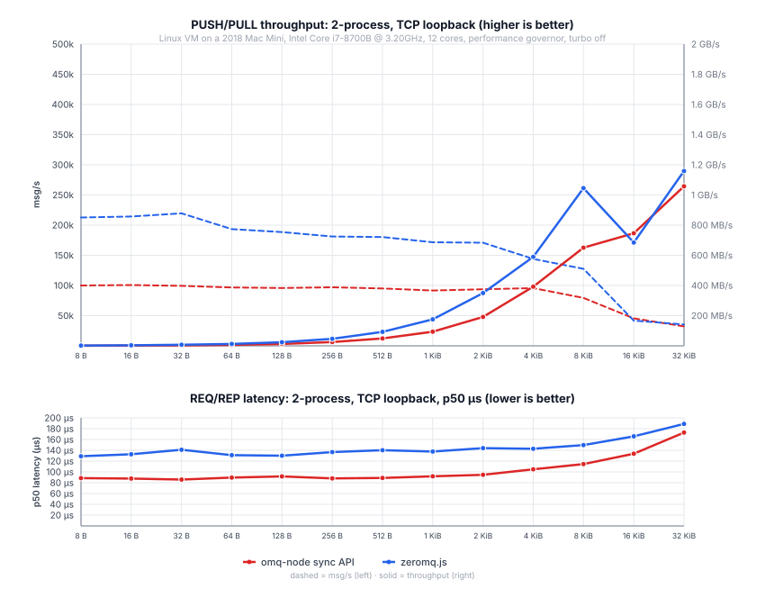

# @zeromq/omq-node

Native Node.js binding for OMQ.rs.

It wraps `omq-tokio`, so routing, reconnect, fair-queueing, auth,
compression, and transport I/O run in OMQ-owned background threads while Node
code gets a small API built around `Context`, typed sockets, `Message`,
`Buffer`, and `Promise`.

This package is for Node main/server processes. Browser code should use
`@zeromq/omq`.

<p align="center">
  
</p>

2-process loopback PUSH/PULL throughput and REQ/REP p50 latency: per-message
`@zeromq/omq-node` sync API calls vs per-message `zeromq.js` calls over TCP.

## Highlights

- Native OMQ engine shared with OMQ.rs.
- High-throughput `tcp://`, native `ipc://`, and `inproc://` messaging.
- Compression transports and static LZ4 dictionaries.
- PLAIN and CURVE security.
- Explicit native context sharing for `inproc://` across Node handles.
- TypeScript definitions and typed socket classes.

## Build, install, test

Requires Node 24.11 or newer.

```sh
npm install
npm run build
npm test
```

The native addon builds through NAPI and loads from `omq_node.node` during
local development. Published packages can load a matching platform prebuild.

## API Shape

- `Context` owns native IO threads and creates sockets.
- `Context.shareKey()` / `Context.fromShareKey(...)` explicitly share one
  native context core and `inproc://` namespace across Node handles.
- `SocketOptions` are passed at socket creation before transport I/O starts.
- `Socket` supports async `send` / `recv`, sync hot paths, `recvManySync`, and
  async iteration.
- `Message` is immutable and supports single-part and multipart payloads.
- Typed socket classes cover `Req`, `Rep`, `Pub`, `Sub`, `XPub`, `XSub`,
  `Push`, `Pull`, `Dealer`, `Router`, `Pair`, `Client`, `Server`, `Radio`,
  `Dish`, `Scatter`, `Gather`, `Channel`, `Peer`, and `Stream`.
- `Sub` exposes `subscribe` / `unsubscribe`; `Dish` exposes `join` / `leave`.
- Sockets are single-thread objects on the JavaScript side; create more
  sockets for more concurrent flows.

`@zeromq/omq-node` is not a `zeromq.js` compatibility layer. It follows ZMQ
socket semantics, but exposes a Node API shaped around this binding.

Example:

```js
const { Pull, Push } = require("@zeromq/omq-node");

async function main() {
  const pull = new Pull();
  const push = new Push();

  try {
    const endpoint = await pull.bind("tcp://127.0.0.1:0");
    await push.connect(endpoint);
    await push.send("hello");
    console.log((await pull.recv()).string());
  } finally {
    push.close();
    pull.close();
  }
}

main();
```

Shared `inproc://` context:

```js
const { Context, Pull, Push } = require("@zeromq/omq-node");

async function main() {
  const owner = new Context();
  const shared = Context.fromShareKey(owner.shareKey());
  const pull = new Pull({}, owner);
  const push = new Push({}, shared);

  try {
    await pull.bind("inproc://example");
    await push.connect("inproc://example");
    await push.send("hello");
    console.log((await pull.recv()).string());
  } finally {
    push.close();
    pull.close();
    shared.close();
    owner.close();
  }
}

main();
```

Socket options:

```js
const { Push } = require("@zeromq/omq-node");

async function main() {
  const push = new Push({
    sendHighWaterMark: 10_000,
    lingerMs: 0,
    workloadProfile: "throughput",
  });

  await push.connect("tcp://127.0.0.1:5555");
}

main();
```
