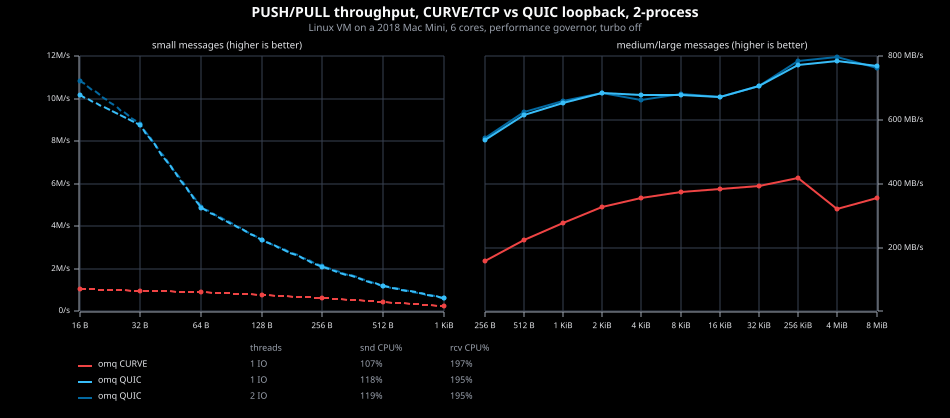
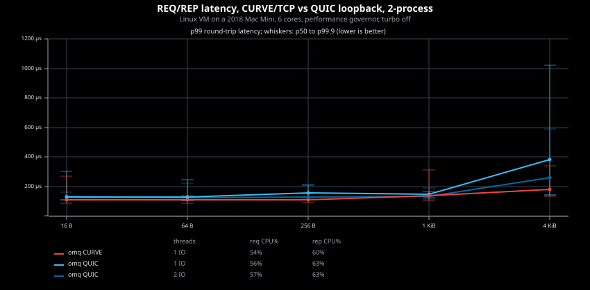
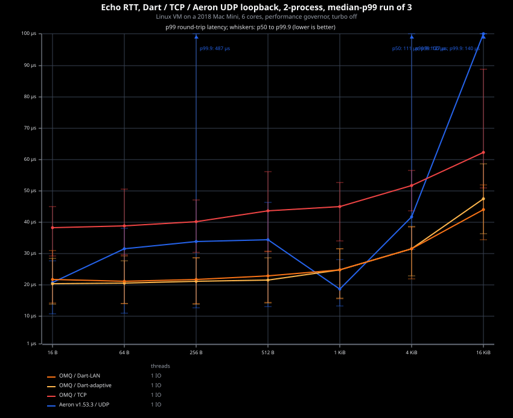
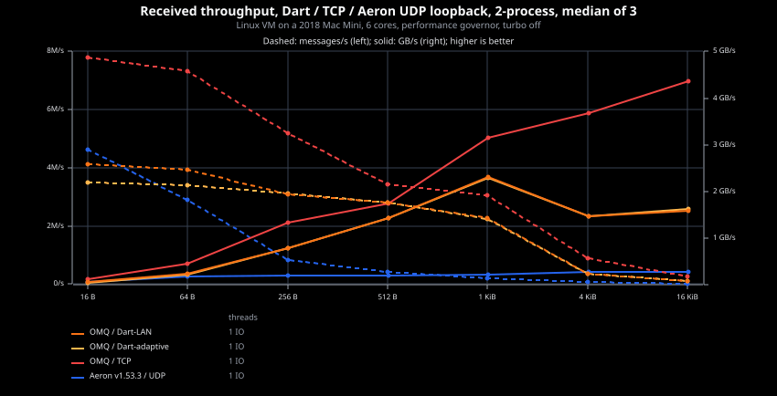
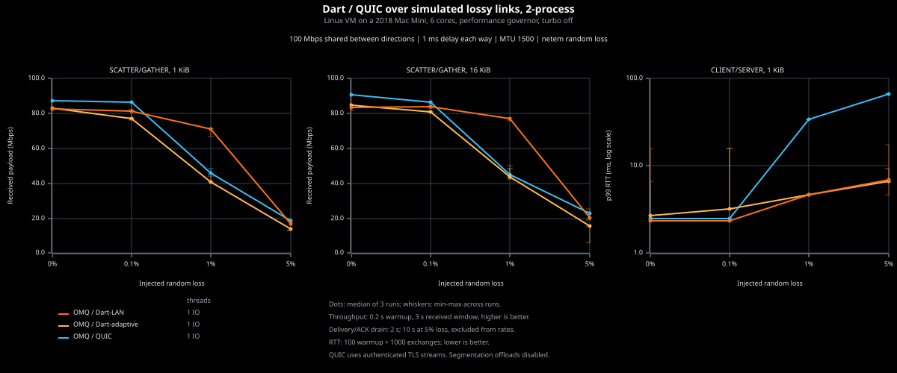

# UDP transports

Select the transport by endpoint URI; applications use ordinary OMQ sockets
and send/recv operations. QUIC and DART require their corresponding Cargo
features. Both reconnect automatically and deliver complete messages in order
within a live connection; neither provides durable delivery across restarts.

| Transport | Purpose | Security | Socket support |
| --- | --- | --- | --- |
| `udp://` | libzmq-compatible, connectionless group messaging; no delivery or ordering guarantee | No authentication or encryption | RADIO/DISH; single-part messages |
| `quic://` | Encrypted messaging with adaptive congestion control and loss recovery | TLS 1.3; verified server certificate | All except STREAM; multipart supported |
| `dart://` | Ultra-low latency and predictable p99 on private networks | No authentication or encryption | SCATTER/GATHER, CLIENT/SERVER, PEER, RADIO/DISH, CHANNEL; single-part messages |

## QUIC

QUIC carries ZMTP over encrypted streams, preserving socket routing,
subscriptions, and multipart messages. Each peer has one ordered data stream
and a separate liveness stream, so receive backpressure does not stop heartbeats.
Messages on the data stream still share head-of-line blocking.

Set the `options.quic` fields before creating the socket. Listeners supply
a certificate and private key; connectors verify the certificate chain and
host name using system or explicit trust roots. TLS authenticates the server;
client authentication uses ZMTP
mechanisms. QUIC provides adaptive congestion control and retransmission.

### Loopback benchmarks

These PUSH/PULL and REQ/REP charts compare QUIC with CURVE/TCP. They use different
socket patterns and spin settings from the DART measurements below.





## DART

DART (Datagram Acknowledgment and Repair Transport) combines per-peer receive
credit, retained messages, NAK repair, and timer recovery. Acknowledgment confirms
remote storage, not application consumption. Small queued messages share UDP
datagrams without waiting to fill a batch. Larger bodies are fragmented;
the receiver checks `max_message_size` before reserving their full u64 length.
DART uses `quinn-udp` for UDP I/O and supports GSO/GRO offloads.

Set the `options.dart` fields before creating the socket. `Adaptive` is the
default; `Lan` keeps receive credit and repair but disables adaptive congestion control
and ECN marking. Use LAN mode on provisioned private paths.
Background IO thread spin (`options.dart.io_spin`) and application receive spin
(`Options::recv_spin()`, blocking API) default off. For example:

```rust
use omq_tokio::Options;
use std::time::Duration;

let mut options = Options::default().recv_spin(Duration::from_micros(50));
options.dart.io_spin = Duration::from_micros(50);
```

Budgets up to 50 μs or `Duration::MAX` enable bounded or continuous polling,
respectively.
Continuous polling needs dedicated CPU resources. DART is native Rust only;
the libzmq compatibility API rejects it.

### Loopback benchmarks

DART has lower p99 round-trip latency than Aeron v1.53.3 at most measured sizes.
These two-process measurements use 50 μs application receive spin plus 50 μs
background IO thread spin, with `WorkloadProfile::Latency`. Aeron uses a SHARED
Media Driver and an exclusive publication. Lines show p99; whiskers span
p50 to p99.9.





## Simulated loss

DART and QUIC run the same SCATTER/GATHER and CLIENT/SERVER workloads over
a netem link: 100 Mbps shared between directions, 1 ms delay each way,
MTU 1500, and 0-5% random loss. Dots show medians of three verified runs;
whiskers show their range. QUIC includes TLS encryption; DART does not.



Wire formats and lifecycle rules: [DART RFC](dart-rfc.md),
[QUIC RFC](quic-rfc.md). Configuration example: [QUIC](../examples/quic.rs).
